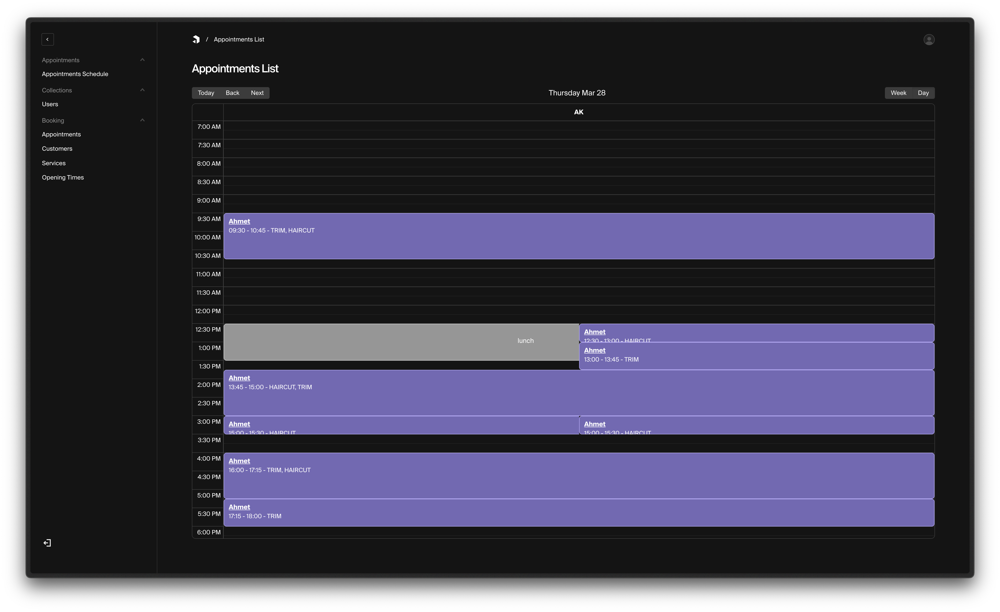
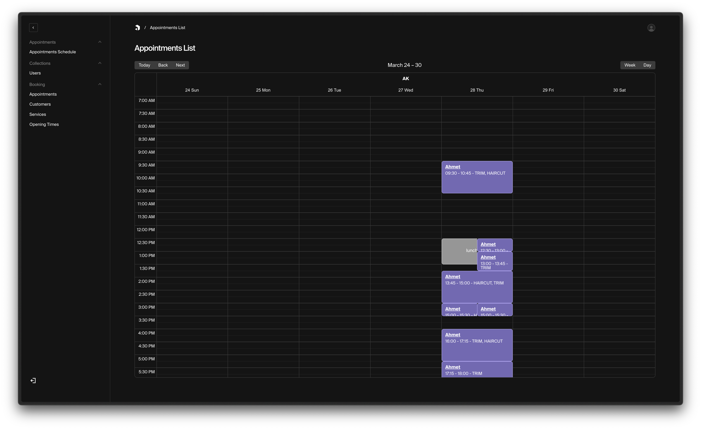
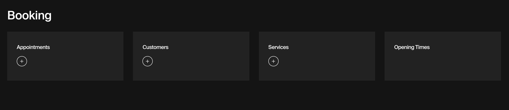

# Payload plugin to add appointment scheduling to your Payload app.

This plugin allows you to add appointment scheduling capabilities to your payload app. It provides:
- Customers, Hosts, Services and Appointments collections
- An Appointment schedule calendar view.
- Opening times global.
- Authentication on Customers collection.







## Installation

#### 1. install

`npm i payload-appointments-plugin`

#### 2. add to config

```typescript
import appointments from "payload-appointments-plugin";

export default buildConfig({
	/* ... */
	plugins: [appointments()],
	/* ... */
});
```

#### 3. add email config

follow instructions on [PayloadCMS Email Docs](https://payloadcms.com/docs/email/overview)

## todo?

- [ ] Customers collection
  - [x] Auth on collection
  - [x] Firstname, lastname, username, dob, email, password
- [ ] Appointments collection
  - [x] Appointment type, Host, Customer, Services, Title, Start date/time, End date/time
  - [x] Appointment type is appointment or blockout (lunch, break, interview, meeting, day off? etc.)
  - [x] Endpoint for getting available time slots 
- [ ] Add new properties/attributes to default auth collection
  - [x] Taking appointments checkbox
  - [x] Preffered name
- [ ] Services collection for ...services
  - [x] Title
  - [x] Description
  - [x] Duration
  - [ ] Cost
- [ ] Emails
  - [x] Email config (Will need to be added by the dev)
  - [ ] React email templates
    - [x] Appointment created email
    - [x] Appointment updated email
    - [ ] Customer signed up email
    - [ ] Forgot password email
- [ ] Custom payload views
  - [x] Appointments schedule view /appointments-schedule
- [ ] Endpoints
  - [x] Get available timeslots for given date, services, host
- [ ] Calendar schedule view
  - [ ] Ability to add appointments by clicking/tapping slot in calendar
    - [ ] Get start date and time from clicked slot
    - [ ] Get host from clicked slot
- [ ] Opening times global
  - [x] Monday...Sunday
  - [x] Set times for different days of week
  - [x] Define if closed on that day

A lot more I want to add. But may need some help.

## testing?

I'm new to testing...