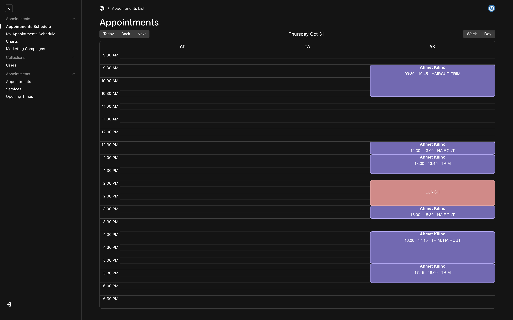
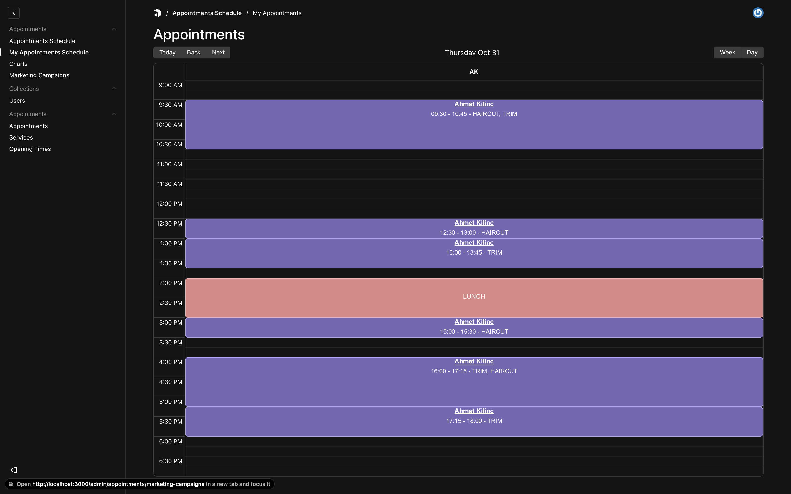
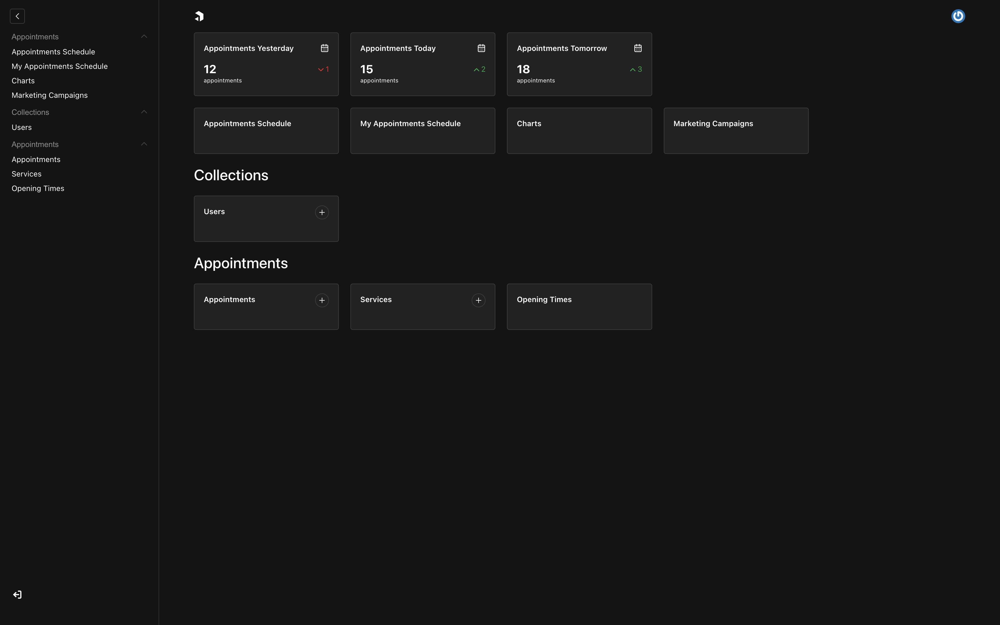

> [!Warning]
> This plugin is a WIP and currently testing.

# Payload plugin to add appointment scheduling to your Payload app.

This plugin allows you to add appointment scheduling capabilities to your payload app. It provides:

- Services and Appointments collections.
- An Appointment schedule calendar view.
- Opening times global.

### Appointments Schedule View For Everyone



### Appointments Schedule View For Logged In User



### Dashboard View



## Installation

#### 1. install

```
npm i payload-appointments-plugin
pnpm install payload-appointments-plugin
yarn add payload-appointments-plugin
```

#### 2. add fields to users collection

```typescript
const Users: CollectionConfig = {
  // ...
  fields: [
    {
      name: 'firstName',
      type: 'text',
      label: 'First name',
    },
    {
      name: 'lastName',
      type: 'text',
      label: 'Last name',
    },
    {
      name: 'roles',
      type: 'select',
      options: [
        {
          value: 'admin',
          label: 'Admin',
        },
        {
          value: 'customer',
          label: 'Customer',
        },
      ],
    },
    {
      name: 'roles',
      type: 'select',
      options: [
        {
          label: 'Admin',
          value: 'admin',
        },
        {
          label: 'Customer',
          value: 'customer',
        },
      ],
    },
    {
      name: 'appointments',
      type: 'join',
      collection: 'appointments',
      defaultLimit: 0,
      maxDepth: 999,
      on: 'customer',
    },
  ],
};

export default Users;
```

#### 3. add to config

```typescript
import appointments from 'payload-appointments-plugin';

export default buildConfig({
  /* ... */
  plugins: [appointmentsPlugin()],
  /* ... */
});
```

#### 4. add email config

follow instructions on [PayloadCMS Email Docs](https://payloadcms.com/docs/email/overview)

## Todo?

- [x] Appointments collection
  - [x] Appointment type, Host, Customer, Services, Title, Start date/time, End date/time
  - [x] Appointment type is appointment or blockout (lunch, break, interview, meeting, day off? etc.)
  - [x] Endpoint for getting available time slots
- [ ] Add new properties/attributes to default auth collection
  - [x] Taking appointments checkbox
  - [x] Preffered name
  - [ ] Calendar subscription
- [x] Services collection for ...services
  - [x] Title
  - [x] Description
  - [x] Duration
  - [x] Cost/Price
    - [ ] Variable cost (per hour... etc.)
- [ ] Emails
  - [ ] Email config (Will need to be added by the dev)
  - [ ] React email templates
    - [ ] Appointment created email
      - [ ] Add iCal link/file to email
    - [ ] Appointment updated email
      - [ ] Add iCal link/file to email
    - [ ] Customer signed up email
- [ ] Custom payload views
  - [x] Appointments schedule view /appointments/schedule
  - [x] Appointments schedule view for loggined in user /appointments/schedule/me
  - [x] Charts /appointments/charts
  - [x] Marketing Campaigns /appointments/marketing-campaigns
  - [ ] ...more to come
- [ ] Endpoints
  - [x] Get available timeslots for given date, services, host
  - [ ] ...more to come
- [ ] Calendar schedule view
  - [x] Ability to update appointment from calendar view
  - [ ] Ability to add appointments by clicking/tapping slot in calendar
    - [x] Add appointments using Payload Drawer
    - [ ] Get start date and time from clicked slot
    - [ ] Get host from clicked slot
- [x] Opening times global
  - [x] Monday...Sunday
  - [x] Set times for different days of week
  - [x] Define if closed on that day
- [x] Add properties for showing/hiding navItems and beforeDashboard
- [ ] Add overrides for collections

A lot more I want to add. But may need some help.
