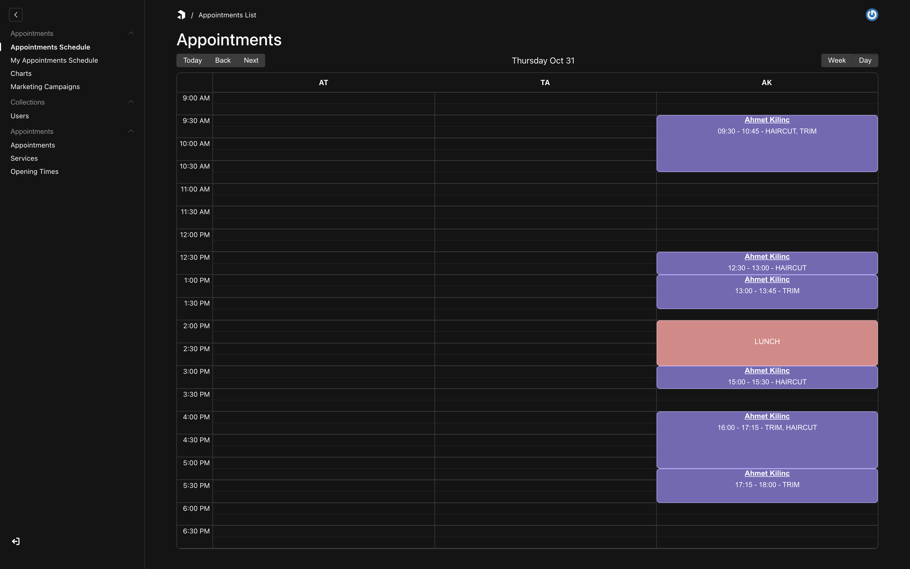
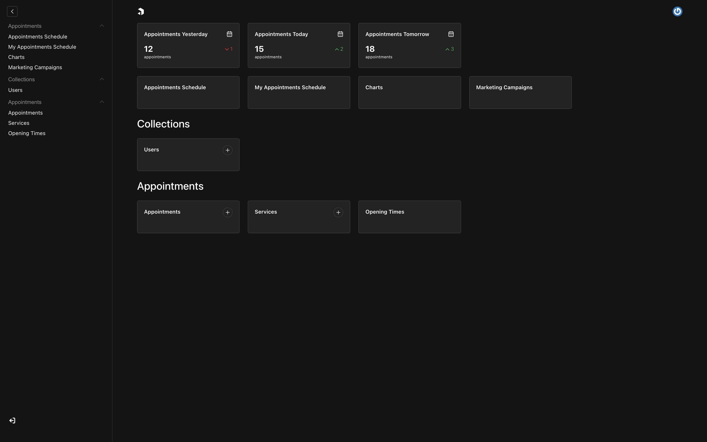

> [!Warning]
> This plugin is a WIP and currently testing.

# Payload Appointments Plugin

Appointment scheduling for your Payload app:

- **Appointments, Services, Team Members, Guest Customers, Waitlist, Sent Emails** collections and an **Opening Times** global.
- Admin **schedule calendar view** (`/admin/appointments/schedule`) and **analytics dashboard** (`/admin/appointments/analytics`).
- Availability engine with buffer times, lead times, max-advance booking, per-host custom hours, and business-timezone handling.
- Recurring appointments (weekly / bi-weekly / monthly series).
- Payments with full/fixed/percentage deposits and a signed payment webhook.
- Customer emails (created / updated / cancelled) with tokenized cancellation links, logged to the Sent Emails collection.
- iCal feeds per team member.
- Waitlist with automatic notification when a slot frees up.
- Jobs Queue tasks for auto-completing past appointments and expiring waitlist notifications.

### Appointments Schedule View



### Dashboard View



## Installation

```
npm i payload-appointments-plugin
pnpm add payload-appointments-plugin
yarn add payload-appointments-plugin
```

### 1. Add the plugin to your config

```ts
import { appointmentsPlugin } from 'payload-appointments-plugin';

export default buildConfig({
  // serverURL is used to build cancellation links in customer emails
  serverURL: 'https://your-app.com',
  plugins: [
    appointmentsPlugin({
      seedData: false, // seed example services/team members/opening times on init
      showDashboardCards: true, // dashboard cards in the admin panel
      showNavItems: true, // nav links for schedule + analytics views
      webhookSecret: process.env.APPOINTMENTS_WEBHOOK_SECRET, // required for the payment webhook
      // paymentHooks: { onPaymentRequired, onPaymentReceived, onRefundRequested },
    }),
  ],
});
```

### 2. Add fields to your users collection

The plugin relates appointment customers to your `users` collection:

```ts
const Users: CollectionConfig = {
  // ...
  fields: [
    { name: 'firstName', type: 'text', label: 'First name' },
    { name: 'lastName', type: 'text', label: 'Last name' },
    {
      name: 'roles',
      type: 'select',
      options: [
        { label: 'Admin', value: 'admin' },
        { label: 'Customer', value: 'customer' },
      ],
    },
    {
      name: 'appointments',
      type: 'join',
      collection: 'appointments',
      on: 'customer',
    },
  ],
};
```

### 3. Configure email

Customer emails use your app's [email adapter](https://payloadcms.com/docs/email/overview). The "from" address is your adapter's `defaultFromAddress` (or the `APPOINTMENT_EMAIL_FROM` env var as a fallback).

### 4. Run the maintenance jobs

The plugin registers two [Jobs Queue](https://payloadcms.com/docs/jobs-queue/overview) tasks:

- `appointmentsAutoComplete` — marks past appointments as completed.
- `appointmentsExpireWaitlist` — expires lapsed waitlist notifications and notifies the next person in line.

Queue and run them on a schedule, e.g. with autorun:

```ts
export default buildConfig({
  jobs: {
    autoRun: [{ cron: '*/15 * * * *', queue: 'default' }],
  },
  onInit: async (payload) => {
    await payload.jobs.queue({ task: 'appointmentsAutoComplete', input: {}, queue: 'default' });
    await payload.jobs.queue({ task: 'appointmentsExpireWaitlist', input: {}, queue: 'default' });
  },
});
```

(Or trigger `payload.jobs.run()` from a cron endpoint on serverless hosts.)

## Plugin options

| Option               | Type           | Default | Description                                                                    |
| -------------------- | -------------- | ------- | ------------------------------------------------------------------------------ |
| `collections`        | `object`       | —       | Per-collection overrides, including `slug` renames (see below).                |
| `globals`            | `object`       | —       | Per-global overrides for `openingTimes`, including `slug`.                     |
| `disabled`           | `boolean`      | `false` | Disables endpoints/UI/hooks. Collections stay registered so the schema is stable. |
| `seedData`           | `boolean`      | `false` | Seeds example opening times, services, and team members on init.               |
| `showDashboardCards` | `boolean`      | `true`  | Show appointment cards on the admin dashboard.                                 |
| `showNavItems`       | `boolean`      | `true`  | Show schedule/analytics links in the admin nav.                                |
| `webhookSecret`      | `string`       | —       | HMAC secret for the payment webhook. The webhook rejects all calls without it. |
| `paymentHooks`       | `PaymentHooks` | —       | Callbacks to integrate a payment provider (see below).                         |

### Collection & slug overrides

Every collection the plugin registers (`appointments`, `guestCustomers`, `sentEmails`,
`services`, `teamMembers`, `waitlist`) and the `openingTimes` global can be customized:

```ts
appointmentsPlugin({
  collections: {
    // Rename the collection — every internal reference (relationships,
    // endpoints, hooks, jobs, admin views) follows the new slug.
    appointments: { slug: 'bookings' },
    services: {
      slug: 'treatments',
      // Extend (or replace) the default fields.
      fields: ({ defaultFields }) => [...defaultFields, { name: 'color', type: 'text' }],
      // Merged one level deep with the defaults.
      access: { read: () => true },
      admin: { group: 'Booking' },
      // Appended after the plugin's own hooks, never replacing them.
      hooks: { afterChange: [myHook] },
    },
  },
  globals: {
    openingTimes: { slug: 'businessHours' },
  },
});
```

Override semantics:

- `slug` renames the collection/global; all internal references follow it.
- `access` and `admin` are merged one level deep with the plugin defaults.
- `hooks` are appended after the plugin's own hooks (the plugin's booking logic
  keeps working).
- `fields` is a function receiving `{ defaultFields }` and returning the final
  field array.
- Any other property is shallow-merged over the default config.

Customer relationships point at your auth collection: the plugin reads
`config.admin.user` (default `users`), so no option is needed for that.

### Payment hooks

```ts
appointmentsPlugin({
  webhookSecret: process.env.APPOINTMENTS_WEBHOOK_SECRET,
  paymentHooks: {
    // Called after an appointment that requires payment is created.
    // Return the provider's payment id (stored as payment.externalPaymentId).
    onPaymentRequired: async (appointment) => {
      const session = await stripe.checkout.sessions.create(/* ... */);
      return { paymentUrl: session.url, paymentId: session.id };
    },
    onPaymentReceived: async (appointment, paymentData) => {
      /* fulfil, notify, etc. */
    },
    onRefundRequested: async (appointment) => {
      /* refund with your provider */
    },
  },
});
```

## Endpoints

All endpoints are mounted under your API route (default `/api`).

| Method   | Path                             | Auth                      | Description                                                                                  |
| -------- | -------------------------------- | ------------------------- | -------------------------------------------------------------------------------------------- |
| `GET`    | `/get-available-appointment-slots` | Public                    | Available slots. Query: `services` (comma-separated ids, required), `day` (required), `host` (optional). Returns `{ availableSlots, filteredSlots, bookingWindow, slotDuration, bufferTime }`. |
| `GET`    | `/appointment-by-token`          | Cancellation token        | Minimal appointment details for the cancellation page. Query: `token`.                       |
| `POST`   | `/cancel-appointment-by-token`   | Cancellation token        | Cancels the appointment for that token. Query: `token`.                                      |
| `POST`   | `/cancel-appointment`            | Authenticated user        | Cancels an appointment by id. Query: `id`.                                                   |
| `PUT`    | `/update-recurring-appointment`  | Authenticated user        | Body: `{ appointmentId, updateType: 'single'\|'all'\|'future', data }`. Only `start`, `end`, `services`, `host`, `customerNotes`, `internalNotes`, `status` are updatable. |
| `POST`   | `/cancel-recurring-appointment`  | Authenticated user        | Body: `{ appointmentId, cancelType: 'single'\|'all'\|'future' }`.                            |
| `GET`    | `/appointments-analytics`        | Authenticated user        | Analytics data. Query: `startDate`, `endDate`, `granularity` (`day`\|`week`\|`month`).       |
| `POST`   | `/appointments-payment-webhook`  | HMAC signature            | See below.                                                                                   |
| `GET`    | `/appointments-ical`             | iCal feed token           | iCal feed for the token's team member. Query: `token`, `months` (default 3, max 24).         |
| `POST`   | `/waitlist/join`                 | Public                    | Body: `{ serviceId, hostId?, customerId?, guestCustomerId?, preferredDates?, preferredTimeRange?, notes? }`. |
| `GET`    | `/waitlist/position`             | Public (by entry id)      | Query: `id`. Returns position in line.                                                       |
| `DELETE` | `/waitlist/leave`                | Authenticated user        | Query: `id`.                                                                                 |

### Payment webhook

`POST /api/appointments-payment-webhook` requires an HMAC-SHA256 signature of the **raw request body** using your `webhookSecret`, sent in the `x-appointments-signature` header (hex):

```ts
import crypto from 'crypto';

const body = JSON.stringify({
  appointmentId: '42',
  paymentId: 'pay_123',
  status: 'success', // 'success' | 'failed' | 'refunded' | 'partial-refund'
  amountPaid: 50,
  // refundAmount: 25, // for partial-refund
});

const signature = crypto.createHmac('sha256', process.env.APPOINTMENTS_WEBHOOK_SECRET).update(body).digest('hex');

await fetch('https://your-app.com/api/appointments-payment-webhook', {
  method: 'POST',
  headers: { 'Content-Type': 'application/json', 'x-appointments-signature': signature },
  body,
});
```

Payment status transitions use the appointment's `payment.amountDue` (deposit) and `payment.totalPrice`: paying at least the deposit → `deposit-paid`, the full price → `paid`.

## iCal feeds

Each team member gets an auto-generated `icalToken` (visible to authenticated users in the admin panel). Subscribe from any calendar app:

```
https://your-app.com/api/appointments-ical?token=<icalToken>
```

## Environment variables

| Variable                       | Purpose                                                                    |
| ------------------------------ | -------------------------------------------------------------------------- |
| `APPOINTMENTS_WEBHOOK_SECRET`  | Suggested env var to pass as `webhookSecret`.                              |
| `APPOINTMENT_EMAIL_FROM`       | Fallback "from" address when the email adapter has no default.             |

## Development

```
pnpm install
pnpm dev        # dev app in ./dev (needs DATABASE_URI + PAYLOAD_SECRET)
pnpm test       # vitest unit tests
pnpm lint
pnpm build
```

## Roadmap

- [x] Collection/slug overrides via plugin options
- [ ] Variable service pricing (per hour, etc.)
- [ ] RRULE-based iCal recurrence
- [ ] Per-day multiple intervals + holiday dates in opening times
- [ ] E2E test suite

Contributions welcome.
